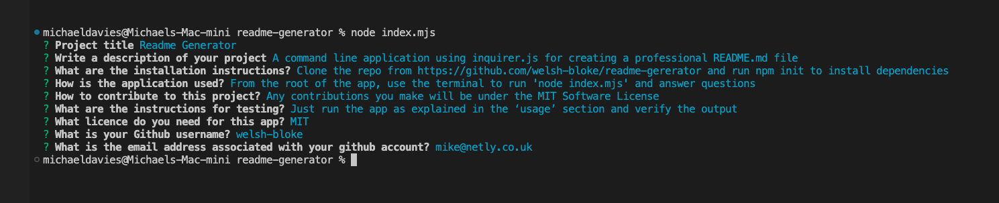

# Module 11 Challenge: Readme Generator

## Overview

The Readme Generator web app was created using Inquirer.js. It generates a series of questions in the terminal, and when complete, generates a professional README.md file. The app generates a README.md file with the following sections:

- [Project title]
- [Project description]
- [A Table Of Contents linking to each section]
- [Installation guide]
- [Usage]
- [Contributing]
- [Tests]
- [Licence]
- [Questions]

After all questions have been answered, the terminal looks like the following screenshot:

## Screenshot Of Terminal

## Deployment

This app was not deployed

## Usage

Open the app in a terminal and run 'node index.mjs

## License

Please refer to the LICENSE in the repo.